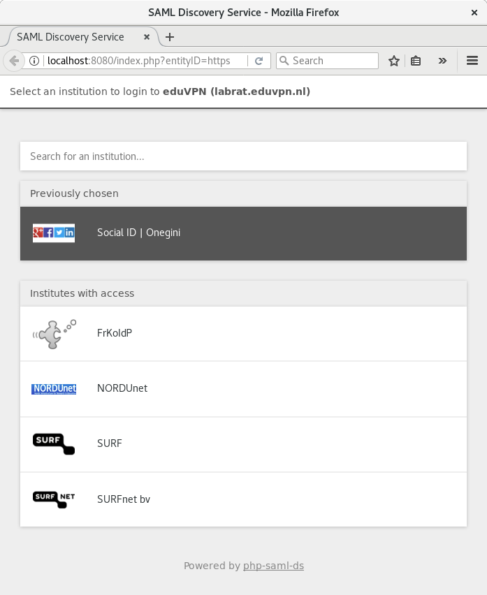

# Introduction

This is a SAML discovery service written in PHP.

**NOTE NOTE NOTE**: this is work in progress, it is not finished.

It follows 
[Identity Provider Discovery Service Protocol and Profile](https://docs.oasis-open.org/security/saml/Post2.0/sstc-saml-idp-discovery.pdf) 
because [mod_auth_mellon](https://github.com/UNINETT/mod_auth_mellon) 
seems to support that. So why not?

# Components

## Generator

A generator script that takes SAML metadata file(s) and extracts the IdPs based 
on the entityIDs that are set in the configuration file. It writes out two 
files:

1. A stripped down SAML metadata file containing only the required entries for
   use by mod_auth_mellon;
2. A JSON file containing information about the IdPs for use by the discovery
   service.

The stripped down SAML metadata file is needed because mod_auth_mellon, at 
least the version shipped with CentOS 7, is unusably slow if you use e.g. the 
entire eduGAIN metadata file.

## Discovery Service

A service that used the JSON file to display a discovery page where the user
can select their IdP. Currently it is very bare bones, see the screenshot.

# Requirements

The software is written in PHP, and requires PHP >= 5.4. Currently we use Twig
as a template engine, but most likely this dependency will disappear as it is 
not really needed for our very minimal use of it. 

# Obtaining Metadata

The `contrib/` directory contains some scripts to download SAML metadata from
eduGAIN, verify the signature and place it in the `config/metadata` directory.

# Configuration

All metadata files you want to use should be placed in the `config/metadata` 
directory and have a `.xml` extension. 

Specify the entityIDs of the IdPs you want to support in the 
`config/config.php` file.

# Running

To run the generator, make sure the metadata files are located in the 
`config/metadata` directory and a writable `data/` directory exists.

    $ php bin/generate.php

# Alternatives

I found some other options when investigating how to do SAML discovery:

* [PyFF](https://github.com/leifj/pyFF/)
* [DiscoJuice](http://discojuice.org/)

I am not sure what PyFF does. It seems to do _everything_, but I don't know 
what exactly, how or why. Apparently it can create discovery pages as well in 
HTML, but couldn't figure out how. I found 
[this](https://wiki.surfnet.nl/pages/viewpage.action?pageId=50106503), but that 
didn't really seem like a lightweight simple approach.

DiscoJuice is not ready for production use it says, whatever that means and 
seems to depend heavily on JS to function, so that's not an option either.
